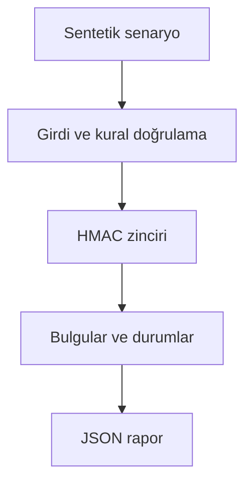

# Mimari

Geçersiz durum geçişlerini ve olay geçmişinin değiştirilmesini fark ederek projeksiyonu yeniden üretmek.

Asıl alan akışı: **append transaction → HMAC chain → legal transition → replay/checkpoint**. CLI JSON yükler, çekirdek `run(config)` alan motorunu çağırır ve JSON seri hale getirir. Veritabanı kullanan örnekler geçici dizinde izole edilir; kalıcı sınıflar doğrudan çağrılırken dosya yolu dışarıdan verilir.

## İnvariant ve başarısızlık sınırı

Zincir anahtarı ve güvenilir checkpoint veritabanından bağımsız korunmalıdır.

Yerel SQLite değiştirilemez kayıt deposu değildir; demo anahtarı üretimde kullanılmamalıdır.

Her hata kararı makine tarafından okunabilir çıktı veya açık exception üretir. Geçersiz yapılandırma sessizce düzeltilmez. Olası tekrarların güvenliği ilgili çekirdeğin kabul kurallarına bağlıdır; bütün projelere ortak bir retry uygulanmaz.
